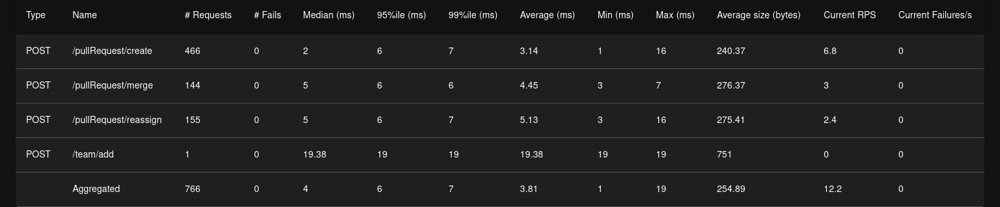
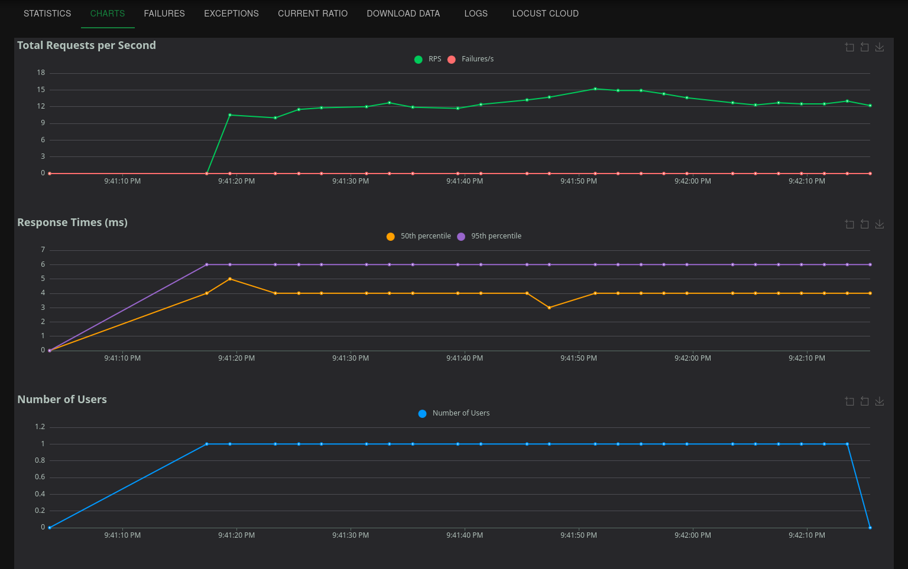
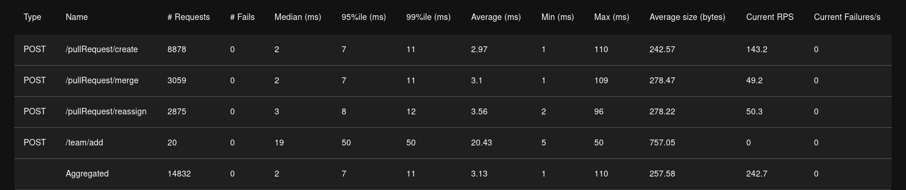
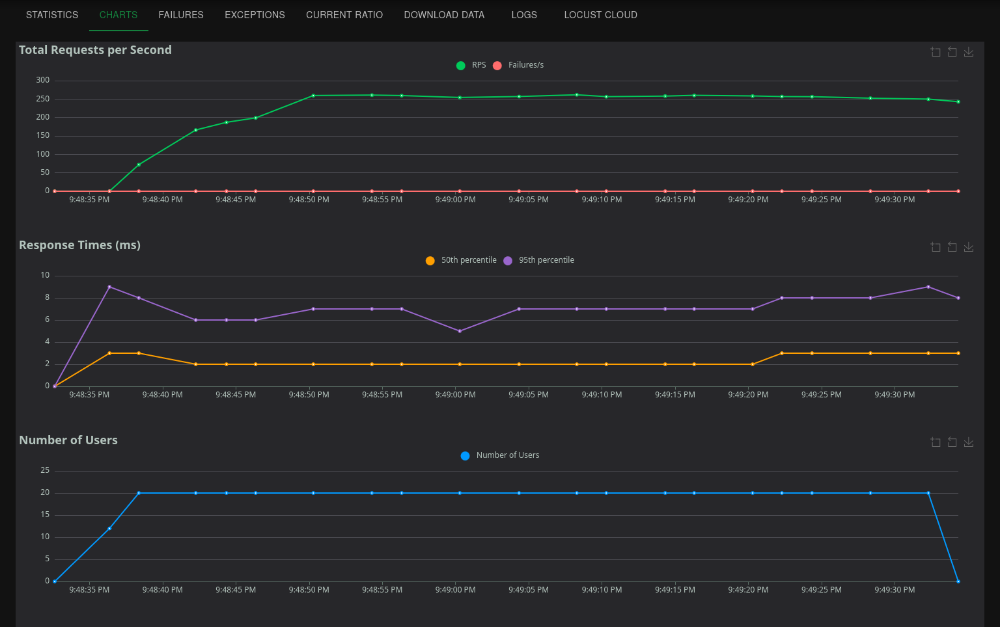
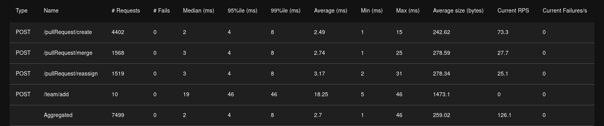
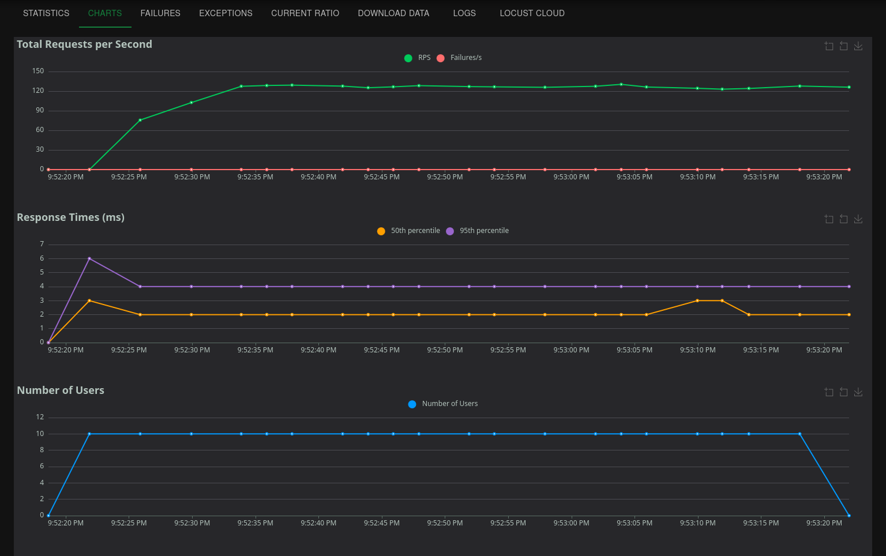

# PR Reviewer Checker

Сервис реализует HTTP API сервиса по управлению pull requests из `openapi.yml`: управление командами/пользователями и автоматическое назначение ревьюеров на Pull Request. Реализация на Go, хранение в PostgreSQL, миграции через `migrate`.

## Запуск

```bash
# основной docker compose (приложение + БД + миграции)
make up
# остановить
make down
```

Локальные переменные и подключения задаются в `docker-compose.yml`. и `.env` А параметры сервера и логгера задаются в файлах из папки `configs/`

## Тестирование

```bash
make unit-test        # go generate + go test
make e2e-test         # docker-compose-e2e up + e2e tests
```

## Нагрузочное тестирование

Для запуска нагрузочного тестирования нужно настроить виртуальное окружение `python` :

```bash
python3 -m venv .venv
source .venv/bin/activate
pip install locust
```

### Нагрузочные сценарии на Python

### Locust

Для интерактивного стресс-теста можно использовать сценарий из `test/load/main.py`:

```bash
locust -f test/load/main.py -H http://127.0.0.1:8080 -u 10 -r 4 -t 1m
```

Каждый юзер создаёт одну команду с заданным числом юзеров. Число пользователей в комманде задаётся через переменные в `test/load/main.py`:
```python
COUNT_USERS_PER_TEAM = 20
COUNT_PRS_PER_USER = 5
WAIT_MIN = 0.05
WAIT_MAX = 0.2
```

### Результаты нагрузочного тестирования
#### 1 комманда с 10 юзерами



#### 10 комманд с 20 юзерами



#### 10 комманд с 10 юзерами



## E2E тестирование

В репозитории есть простые  тесты (`test/e2e`) и отдельный docker-compose (`docker-compose-e2e.yml`), который поднимает БД, выполняет миграции, стартует приложение и запускает контейнер с `go test`.

```bash
make e2e-test
```

`E2E_BASE_URL` можно переопределить через `.env`, чтобы тесты ходили в другой инстанс сервиса.

## Миграции

SQL миграции лежат в папке `migrations/`. `docker-compose.yml` автоматически выполняет `000001_init`, `000002_add_idx`

## API

Полная спецификация в `openapi.yml`. Примеры запросов:

```bash
curl -X POST http://localhost:8080/team/add -H 'Content-Type: application/json' \
  -d '{"team_name":"backend","members":[{"user_id":"u1","username":"Alice","is_active":true}]}'

# статистика по ревьюверам
curl http://localhost:8080/stats/reviewers

# агрегированная статистика по PR
curl http://localhost:8080/stats/pullRequests

# проверка здоровья
curl http://localhost:8080/healthz
```
